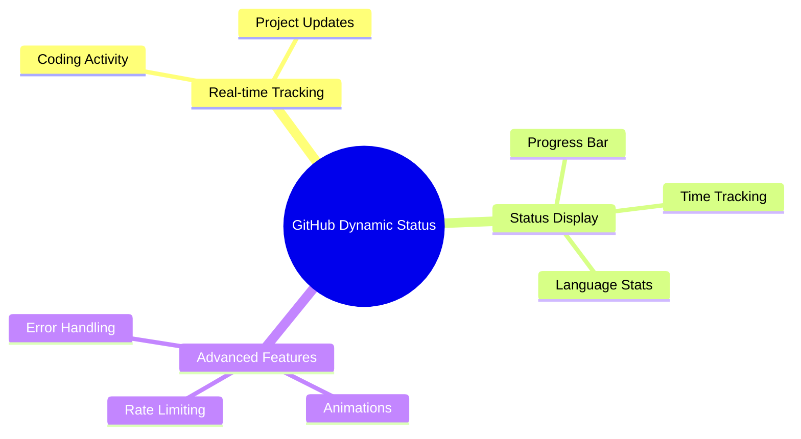

# 🚀 GitHub Dynamic Status

<div align="center">


<p align="center">
  <a href="#features">Features</a> •
  <a href="#prerequisites">Prerequisites</a> •
  <a href="#installation">Installation</a> •
  <a href="#usage">Usage</a> •
  <a href="#configuration">Configuration</a>
</p>

[](LICENSE)
[](https://github.com/lohitkolluri/GitHub-Dynamic-Status/stargazers)
[](https://github.com/lohitkolluri/GitHub-Dynamic-Status/network)
[](https://github.com/lohitkolluri/GitHub-Dynamic-Status/issues)

<p align="center">A dynamic GitHub status updater that displays your real-time coding activity using WakaTime data. Watch your GitHub profile come alive with your coding journey! ✨</p>

</div>

## ✨ Features

<div align="center">



</div>

- 🔄 Real-time coding activity tracking
- 🎯 Automatic GitHub status updates
- 📊 Progress bar showing daily coding goals
- 💻 Most used programming language display
- ⚙️ Configurable update intervals
- 🎨 Animated status icons
- 🛡️ Rate limiting protection
- 🔧 Error handling and retry mechanisms

## 🚦 Prerequisites

<table align="center">
  <tr>
    <td align="center" width="96">
      
      <br>Node.js v14+
    </td>
    <td align="center" width="96">
      
      <br>GitHub
    </td>
    <td align="center" width="96">
      
      <br>WakaTime
    </td>
  </tr>
</table>

## 🚀 Installation

1️⃣ Clone the repository:

```bash
git clone https://github.com/lohitkolluri/GitHub-Dynamic-Status.git
cd GitHub-Dynamic-Status
```

2️⃣ Install dependencies:

```bash
npm install
```

3️⃣ Create a `.env` file:

```env
GITHUB_TOKEN=your_github_token
WAKATIME_API_KEY=your_wakatime_api_key
NODE_ENV= 'prod' or 'dev' based on your deployment
```

## ⚙️ Configuration

<details>
<summary>Click to expand configuration options</summary>

```javascript
const config = {
  updateInterval: 15 * 60 * 1000, // ⏰ Status update frequency (default: 15 minutes)
  maxStatusLength: 80, // 📏 Maximum status message length
  progressBarLength: 10, // 📊 Length of the progress bar
  retryAttempts: 3, // 🔄 Number of retry attempts for API calls
  debug: false, // 🐛 Enable debug logging
  activityWindow: 60, // ⏱️ Time window to consider active coding (in seconds)
};
```

</details>

## 🎨 Status Format

<div align="center">

```
⏰ 2h30m ⟫ 📂 ProjectName ⟫ ⬢⬢⬢⬢⬢⬡⬡⬡⬡⬡ 50% ⟫ JavaScript
```

| Icon | Meaning                         |
| :--: | :------------------------------ |
|  ⏰  | Total coding time today         |
|  📂  | Current/last active project     |
|  ⬢⬡  | Progress bar showing daily goal |
|  🔤  | Most used programming language  |

</div>

## 💻 Usage

<details>
<summary>Basic Usage</summary>

```javascript
import { WakaTimeStatus } from './path/to/module';

const statusUpdater = new WakaTimeStatus();

// Add event listeners
statusUpdater.on('statusUpdated', (status) =>
  console.log('Status updated:', status),
);
statusUpdater.on('error', (error) => console.error('Error:', error));

// Start the updater
statusUpdater.start();
```

</details>

<details>
<summary>Advanced Usage</summary>

```javascript
const config = {
  updateInterval: 15 * 60 * 1000, // 15 minutes
  progressBarLength: 15,
  debug: true,
};

const statusUpdater = new WakaTimeStatus(config);

statusUpdater.on('started', () => console.log('Status updater started'));
statusUpdater.on('stopped', () => console.log('Status updater stopped'));
statusUpdater.on('statusUpdated', (status) =>
  console.log('Status updated:', status),
);
statusUpdater.on('error', (error) => console.error('Error occurred:', error));

await statusUpdater.start();
```

</details>

## 📡 Events

<div align="center">

|      Event      | Description                            |
| :-------------: | :------------------------------------- |
|    `started`    | 🟢 When the status updater starts      |
|    `stopped`    | 🔴 When the status updater stops       |
| `statusUpdated` | 🔄 When a new status is set            |
|     `error`     | ⚠️ When an error occurs                |
|  `dataFetched`  | 📥 When new WakaTime data is retrieved |

</div>

## 🛡️ Error Handling

The module includes robust error handling for:

- 🚫 Rate limiting
- 🌐 API failures
- 🔑 Missing environment variables
- ⚙️ Invalid configurations

## 📄 License

<div align="center">

MIT License © [Lohit Kolluri](LICENSE) - feel free to use this project as you wish!


</div>
