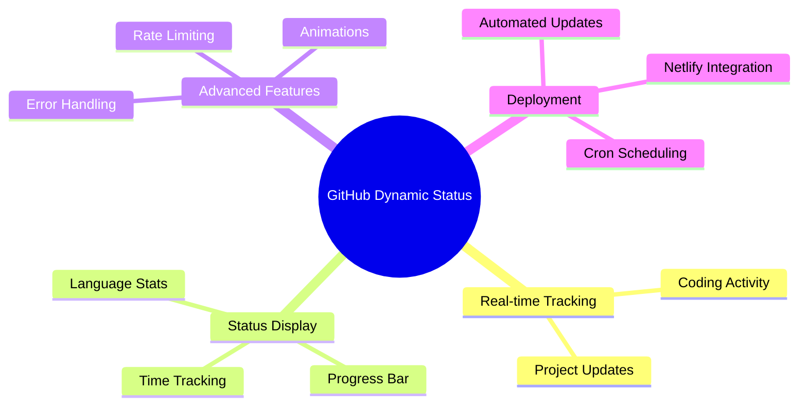

<div align="center">


<p align="center">
  <a href="#features">Features</a> •
  <a href="#prerequisites">Prerequisites</a> •
  <a href="#installation">Installation</a> •
  <a href="#deployment">Deployment</a> •
  <a href="#configuration">Configuration</a> •
  <a href="#usage">Usage</a>
</p>

[](LICENSE)
[](https://github.com/lohitkolluri/GitHub-Dynamic-Status/stargazers)
[](https://github.com/lohitkolluri/GitHub-Dynamic-Status/network)
[](https://github.com/lohitkolluri/GitHub-Dynamic-Status/issues)

<p align="center">A dynamic GitHub status updater that displays your real-time coding activity using WakaTime data. Watch your GitHub profile come alive with your coding journey! ✨</p>

</div>

## ✨ Features

<div align="center">



</div>

- 🔄 Real-time coding activity tracking
- 🎯 Automatic GitHub status updates
- 📊 Progress bar with daily coding goals
- 💻 Most used programming language display
- ⚙️ Configurable update intervals
- 🎨 Animated status icons
- 🛡️ Rate limiting protection
- 🔧 Error handling with retry mechanism
- 🌐 Easy deployment to Netlify
- ⏰ Automated updates via cron-job.org

## 🚦 Prerequisites

<table align="center">
  <tr>
    <td align="center" width="96">
      
      <br>Node.js v14+
    </td>
    <td align="center" width="96">
      
      <br>GitHub
    </td>
    <td align="center" width="96">
      
      <br>WakaTime
    </td>
    <td align="center" width="96">
      
      <br>Netlify
    </td>
  </tr>
</table>

### Required Accounts & Keys

- Netlify Account (for deployment)
- cron-job.org Account (for scheduling)
- GitHub Personal Access Token with `user` scope
- WakaTime API Key

## 🚀 Installation

1️⃣ Clone the repository:

```bash
git clone https://github.com/lohitkolluri/GitHub-Dynamic-Status.git
cd GitHub-Dynamic-Status
```

2️⃣ Install dependencies:

```bash
npm install
```

3️⃣ Install Netlify CLI:

```bash
npm install -g netlify-cli
```

## 📦 Deployment

### 🌐 Deploy to Netlify

1️⃣ Login to Netlify CLI:

```bash
netlify login
```

2️⃣ Initialize Netlify project:

```bash
netlify init
```

3️⃣ Set environment variables:

```bash
netlify env:set GITHUB_TOKEN your_github_token
netlify env:set WAKATIME_API_KEY your_wakatime_api_key
netlify env:set NODE_ENV prod
```

4️⃣ Deploy to production:

```bash
netlify deploy --prod
```

During deployment, use these settings:

- Build command: `npm install`
- Publish directory: Leave empty or use `.`
- Functions directory: `functions`

### ⏰ Setup Cron Job

1️⃣ Go to [cron-job.org](https://cron-job.org/en/) and create an account

2️⃣ Create a new cron job:

- Title: "Update GitHub Status"
- URL: `https://your-site-name.netlify.app/.netlify/functions/UpdateStatus`
- Schedule: Every 15 minutes (`*/15 * * * *`)
- Request method: GET
- Notifications: Enable on failure (recommended)

3️⃣ Save and activate the cron job

## 🎨 Status Format

<div align="center">

```
⏳ 2h30m ⟫ 📂 ProjectName ⟫ ⬢⬢⬢⬢⬢⬡⬡⬡⬡⬡ 50% ⟫ JavaScript
```

| Icon | Meaning                         |
| :--: | :------------------------------ |
|  ⏳  | Total coding time today         |
|  📂  | Current/last active project     |
|  ⬢⬡  | Progress bar showing daily goal |
|  ⟫   | Section separator               |

</div>

## ⚙️ Configuration

<details>
<summary>Click to expand configuration options</summary>

```javascript
const config = {
  updateInterval: 15 * 60 * 1000, // ⏰ Status update frequency (default: 15 minutes)
  maxStatusLength: 80, // 📏 Maximum status message length
  progressBarLength: 20, // 📊 Length of the progress bar (10 in handler)
  retryAttempts: 3, // 🔄 Number of retry attempts for API calls
  baseURL: 'https://wakatime.com/api/v1', // 🌐 WakaTime API base URL
  debug: process.env.NODE_ENV === 'dev', // 🐛 Enable debug logging based on environment
  activityWindow: 300, // ⏱️ Time window to consider active coding (5 minutes in seconds)
};
```

Status Config Options:

```javascript
{
    progressFilled: '⬢', // Filled progress bar character
    progressEmpty: '⬡', // Empty progress bar character
    timeIcon: '⏳', // Time display icon
    projectIcon: '📂', // Project name icon
    codingIcon: '💻', // Active coding icon
    idleIcon: '🌙', // Idle status icon
    errorIcon: '⚠️', // Error status icon
    separator: '⟫' // Section separator
}
```

</details>

## 💻 Usage

<details>
<summary>Basic Usage</summary>

```javascript
import { WakaTimeStatus } from './path/to/module';

const statusUpdater = new WakaTimeStatus();

// Add event listeners
statusUpdater.on('statusUpdated', (status) =>
  console.log('Status updated:', status),
);
statusUpdater.on('error', (error) => console.error('Error:', error));

// Start the updater
statusUpdater.start();
```

</details>

<details>
<summary>Advanced Usage</summary>

```javascript
const config = {
  updateInterval: 15 * 60 * 1000, // 15 minutes
  progressBarLength: 15,
  debug: true,
};

const statusUpdater = new WakaTimeStatus(config);

statusUpdater.on('started', () => console.log('Status updater started'));
statusUpdater.on('stopped', () => console.log('Status updater stopped'));
statusUpdater.on('statusUpdated', (status) =>
  console.log('Status updated:', status),
);
statusUpdater.on('error', (error) => console.error('Error occurred:', error));

await statusUpdater.start();
```

</details>

## 🔍 Monitoring

- Check your Netlify function logs in the Netlify dashboard for function execution details
- Monitor cron job execution in cron-job.org dashboard for scheduling reliability
- Watch your GitHub profile status for successful updates
- Enable notifications in cron-job.org for immediate failure alerts

## 📡 Events

<div align="center">

|      Event      | Description                            |
| :-------------: | :------------------------------------- |
|    `started`    | 🟢 When the status updater starts      |
|    `stopped`    | 🔴 When the status updater stops       |
| `statusUpdated` | 🔄 When a new status is set            |
|     `error`     | ⚠️ When an error occurs                |
|  `dataFetched`  | 📥 When new WakaTime data is retrieved |

</div>

## 🛡️ Error Handling

The module includes robust error handling for:

- 🚫 Rate limiting with exponential backoff
- 🌐 API failures with automatic retry
- 🔑 Missing or invalid environment variables
- ⚙️ Invalid configurations
- 📡 Network connectivity issues
- ⏱️ Request timeouts

## 🔧 Troubleshooting

<details>
<summary>Common Issues</summary>

1. **Function not deploying**

   - Verify your `netlify.toml` configuration
   - Check if the functions directory is correct
   - Ensure all dependencies are in `package.json`

2. **Status not updating**

   - Verify your environment variables in Netlify
   - Check cron job execution logs
   - Ensure GitHub token has correct permissions

3. **Rate limiting issues**
   - Adjust the cron job frequency
   - Check WakaTime API quotas
   - Verify rate limiting configuration
   </details>

## 📄 License

<div align="center">

MIT License © [Lohit Kolluri](LICENSE) - feel free to use this project as you wish!


</div>
